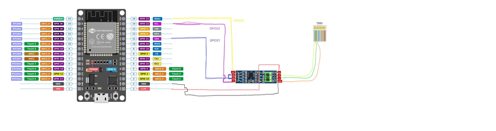

# ESP32 Hardware connection and wiring


## Schematics

```
                              CONVERTER                          UART-TTL
┌──────────┐                ┌───────────┐                       ┌─────────┐
│          │<----- A  ----->│  SERIAL   │<-----------------Vcc--│         │<--Vcc
│  JK-BMS  │<----- B  ----->│  TTL TO   │                       │ ESP32/  │
│          │                │  RS485    │--RO---------------RX->│ ESP8266 │
│          │                │           │<-DI---------------TX--│         │
│          │                │ CONVERTER │<-DE-----+             │         │
│          │                │           │<-RE-----└---TALK PIN--│         │
│          │                │           │                       │         │
|          |<------GND----->|           |<----------GND-------->|         |<--GND
└──────────┘                └───────────┘                       └─────────┘

```
Details
- Vcc: Could be connected to 3.3v or 5v 


## RJ45

At the JKBMS Looking the connector from the bottom/back, the clip should be facing down.

```
Use any of the two wirings:
┌─────────────────────────┐          ┌─────────────────────────┐
│                         │          │                         │
│ O  O  O  O  O  O  O  O  │   OR     │ O  O  O  O  O  O  O  O  │
│ 1  2  3  4  5  6  7  8  │          │ 1  2  3  4  5  6  7  8  │
└─────────────────────────┘          └─────────────────────────┘
  │  │  │                                             │  │  │   
  │  │  └──── GND                              GND ───┘  │  │   
  │  └─────── A                                  A ──────┘  │   
  └────────── B                                  B ─────────┘   
```

## Example

In the next example i will use a RJ45 type A connector, but for the JK itself the code colors and order of them are irrelevant, you could use one pair of wires and another wire to be ground. Just use the 1,2,3 or the 8,7,6 as the upper configuration.



> (Click on the image to enlarge)

## Remainders

- Remember the GPIO pins that you use, to configure the esp yaml file later.
- I never test it with the physical TX and RX pin, so be advise, i don't know it it works.

