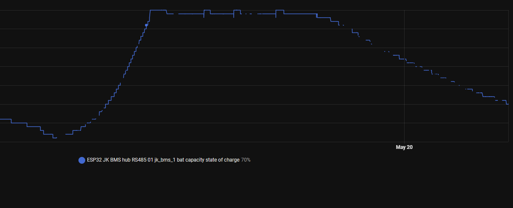
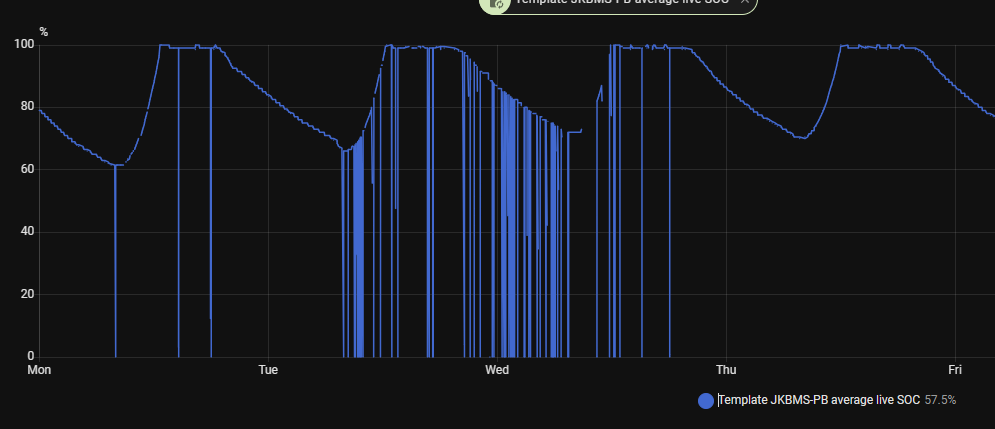

# Troubleshooting

## Home Assistant API disconnections

If Home Assistant frequently disconnects from the ESP device, or if the ESPHome API becomes unstable under load, the most common cause is an excessive publication rate. This project includes three configuration options to reduce the number of state updates sent to Home Assistant.

Another possible cause is API encryption. In recent testing, encrypted API connections were linked to repeated disconnects and continuous errors on some installations.

These options are configured inside the `jk_rs485_sniffer` block:

```yaml
jk_rs485_sniffer:
  - id: sniffer0
    protocol_version: ${protocol_version}
    rx_timeout: 500ms
    uart_id: uart_0
    talk_pin: ${talk_pin_rs485}
    sensor_publish_interval: 25s
    number_publish_interval: 40s
    text_publish_interval: 60s
```

## What each variable does

### `sensor_publish_interval`

Controls how often regular sensor values are published to Home Assistant.

Examples:

- battery voltage
- battery current
- temperatures
- cell voltages

Recommended starting point:

```yaml
sensor_publish_interval: 25s
```

If Home Assistant still disconnects, try increasing it gradually. If the value is too high, the system becomes more stable but sensor refresh feels slower. In current testing, `35s` was considered too much delay for normal usage.

### `number_publish_interval`

Controls how often number entities are published.

Examples:

- protection thresholds
- voltage settings
- current limits
- timing-related configuration values

Recommended starting point:

```yaml
number_publish_interval: 40s
```

Number entities usually do not need fast refresh because they are configuration-oriented values, not fast-changing runtime telemetry.

### `text_publish_interval`

Controls how often text sensor values are published.

Examples:

- errors
- formatted runtime
- network node summaries
- device information text fields

Recommended starting point:

```yaml
text_publish_interval: 60s
```

Text sensors are often expensive from an API traffic perspective and usually do not need high-frequency updates.

## How to tune the intervals

Start with:

```yaml
sensor_publish_interval: 25s
number_publish_interval: 40s
text_publish_interval: 60s
```

Then adjust only if necessary:

- If Home Assistant disconnects or reconnects often, increase the intervals.
- If the system is stable but updates feel too slow, reduce them carefully.
- Change one variable at a time so you can identify which category is causing the load.

Binary sensors and alarm-related state changes remain immediate, so increasing these intervals should mainly affect non-binary telemetry and configuration updates.

## Remove sensors you do not use

Another effective way to reduce ESPHome API load is to remove or comment out entities that you do not actively use.

This is especially recommended for:

- sensors that are not relevant for your installation
- sensors that remain blank
- sensors that appear as `unknown`
- sensors that appear as `not supported`
- sensors that are not available through your current BMS communication path

If a sensor does not provide useful data in your setup, keeping it enabled still adds configuration size, entity count, and potential publication work. Reducing unnecessary entities is often a safer optimization than making all intervals too aggressive.

### Example: `cell_resistance_*`

Per-cell resistance sensors are a good example because there can be many of them, and they are not always needed for daily monitoring.

If you do not need them permanently, comment them out and keep only the summary values such as minimum and maximum cell resistance. That gives you a lighter configuration while still preserving a quick way to review resistance behavior from time to time.

Example:

```yaml
cell_resistance_min:
  name: "${jkibms_top_left_03} cell resist min"
cell_resistance_max:
  name: "${jkibms_top_left_03} cell resist max"
cell_resistance_min_cell_number:
  name: "${jkibms_top_left_03} cell resist min cell number"
cell_resistance_max_cell_number:
  name: "${jkibms_top_left_03} cell resist max cell number"

# cell_resistance_01:
#   name: "${jkibms_top_left_03} cell resist 01"
# cell_resistance_02:
#   name: "${jkibms_top_left_03} cell resist 02"
# cell_resistance_03:
#   name: "${jkibms_top_left_03} cell resist 03"
# cell_resistance_04:
#   name: "${jkibms_top_left_03} cell resist 04"
# cell_resistance_05:
#   name: "${jkibms_top_left_03} cell resist 05"
# cell_resistance_06:
#   name: "${jkibms_top_left_03} cell resist 06"
# cell_resistance_07:
#   name: "${jkibms_top_left_03} cell resist 07"
# cell_resistance_08:
#   name: "${jkibms_top_left_03} cell resist 08"
# cell_resistance_09:
#   name: "${jkibms_top_left_03} cell resist 09"
# cell_resistance_10:
#   name: "${jkibms_top_left_03} cell resist 10"
```

If later you want to inspect those values again, you can temporarily re-enable them, validate the readings, and then disable them again.

## What to look for

If you are hitting this problem, review the disconnect examples shown below:





Use that image as a reference for the kind of API instability this tuning is intended to reduce. If your logs or Home Assistant behavior look similar, increase the publish intervals before changing lower-level UART or network settings.

## Check API encryption

If publication tuning is not enough, review whether API encryption is enabled in your ESPHome configuration.

Example:

```yaml
api:
  # 2026-05-22: Avoid using the encryption. HA, esphome and my esp32 have problems,
  # they disconnect and raise errors continuously on some installations.
  # encryption: # url: https://esphome.io/components/api/
  #   key: "Ng6pWrCXRhKIrlaGjDD0c/ZKGcbsFUNddLJviC1U/i4="
```

If you are seeing repeated API disconnects, test the system with encryption disabled and compare stability. If the disconnects stop, keep encryption disabled for that installation unless you have a strong reason to require it.

## Practical recommendation

For most installations, do not start by making the sniffer more aggressive. Start by reducing publication pressure first. That is the safest change because it preserves protocol behavior while lowering the load on the ESPHome API and Home Assistant connection.
